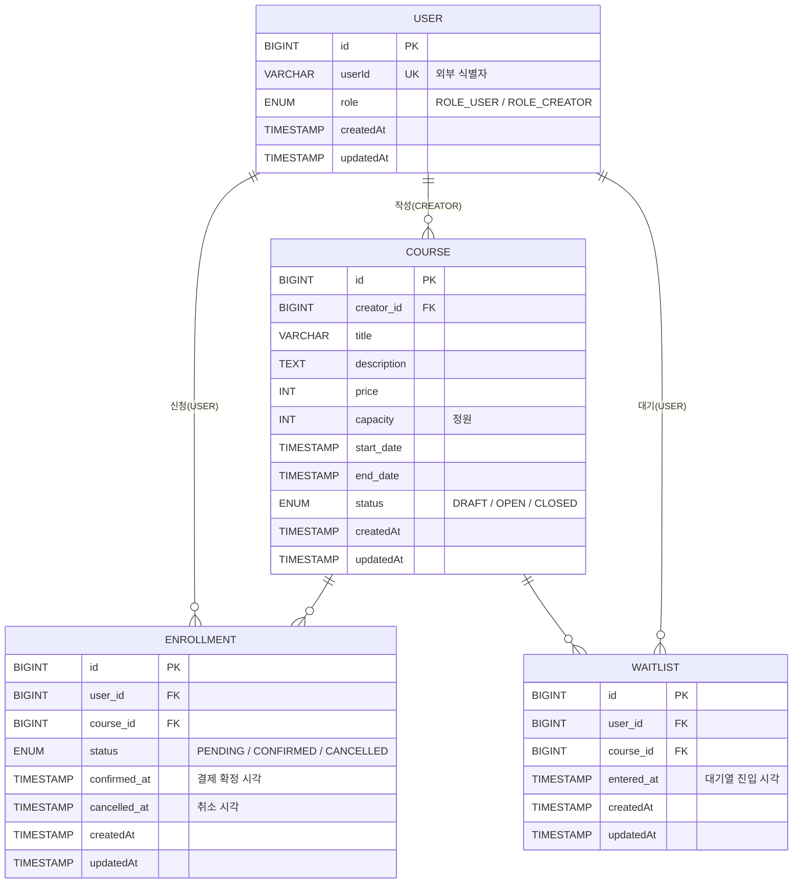

<details open>
<summary><h2>프로젝트 개요</h2></summary>

본 프로젝트는 강사(크리에이터)가 강의를 개설하고 수강생이 신청·결제·취소하는 흐름을 다루는 백엔드 시스템입니다. 정원 관리·결제 기한·대기열·환불 규칙을 어긋나지 않게 구현하는 것이 본 과제의 중심입니다.

### 배경 시나리오

강사는 강의를 임시저장한 뒤 **오픈**하면, 수강생이 목록에서 강의를 보고 신청할 수 있습니다. 신청 후 30분 안에 결제를 완료해야 수강이 확정되고, 정원이 다 차 있으면 대기열에 자동으로 합류합니다. 수강 확정 후 7일 안에는 취소가 가능합니다.

### 사용자 역할

- **`ROLE_CREATOR` (강사/크리에이터)**: 강의를 임시저장·오픈·마감하고, 자신의 강의에 대한 수강생 목록을 조회합니다.
- **`ROLE_USER` (수강생)**: 강의 목록·상세를 보고, 수강 신청·결제 확정·취소를 합니다. 자신의 신청 내역도 조회합니다.

### 핵심 기능

- 강의 관리: 임시저장(`DRAFT`), 오픈(`OPEN`), 마감(`CLOSED`), 목록·상세 조회
- 수강 신청 흐름: 신청(`PENDING`) → 결제 확정(`CONFIRMED`) → 취소(`CANCELLED`)
- 정원이 찬 강의에는 대기열 자동 진입, 자리 발생 시 자동 승급
- 크리에이터용 수강생 목록 조회 / 사용자용 내 신청 목록 조회(페이지네이션)

### 핵심 비즈니스 규칙

- **정원 관리**: 강의별 정원을 초과하지 않도록 동시 신청 상황도 고려합니다.
- **결제 기한 30분**: `PENDING` 상태에서 30분 안에 결제하지 못하면 자동 취소됩니다.
- **7일 내 환불**: 결제 확정 후 7일 이내에만 수강 취소가 가능합니다.
- **대기열 자동 승급**: 자리가 생기면 대기열의 첫 사람이 자동으로 결제 단계로 올라갑니다.

</details>

<details>
<summary><h2>기술 스택</h2></summary>

| 분류 | 기술 |
|------|------|
| **BE** |   |
| **DB** |   |
| **Build** |  |
| **Test** |  |
| **Docs** |  |

</details>

<details>
<summary><h2>실행 방법</h2></summary>

### 사전 요구사항

- **Java 17 이상** (Gradle toolchain이 자동으로 17을 지정하므로 별도 설정 없이도 동작합니다)
- **Git**
- 별도 DB 설치는 필요 없습니다. 런타임 DB는 H2 in-memory로 부팅 시 자동 기동됩니다.

### 로컬 실행

저장소를 받아 Gradle Wrapper로 바로 실행합니다.

```powershell
# Windows (PowerShell)
git clone https://github.com/gusgh075/liveklass-assignment-course-registration.git
cd liveklass-assignment-course-registration
.\gradlew.bat bootRun
```

```bash
# macOS / Linux
git clone https://github.com/gusgh075/liveklass-assignment-course-registration.git
cd liveklass-assignment-course-registration
./gradlew bootRun
```

부팅 후 접근 경로:

| 항목 | URL |
|------|-----|
| 애플리케이션 | <http://localhost:8080> |
| API 문서(Swagger UI) | <http://localhost:8080/swagger-ui.html> |

### 실행 가능한 jar 빌드 후 구동

```powershell
.\gradlew.bat build
java -jar build\libs\course-0.0.1-SNAPSHOT.jar
```

`.\gradlew.bat build`는 컴파일 → 테스트 → jar 생성을 한 번에 수행합니다. 테스트를 건너뛰고 jar만 만들고 싶을 땐 `.\gradlew.bat bootJar -x test`를 사용합니다.

</details>

<details>
<summary><h2>요구사항 해석 및 가정</h2></summary>

### 1. 강의 수강 기간 종료 시 자동 마감
- **관련 요구사항**: #1 강의 등록
- **해석 및 가정**: 수강 기간(시작일~종료일)이 명시되어 있으므로 종료일 이후에는 신청을 받지 않는다.
- **결정**: 종료일 경과 시 `OPEN → CLOSED`로 상태를 전이한다.

### 2. 강의 목록 조회에서 DRAFT 제외
- **관련 요구사항**: #2 강의 목록 조회
- **해석 및 가정**: `DRAFT`는 크리에이터용 임시 저장 상태로, 사용자에게 노출되어선 안 된다.
- **결정**: 목록 조회는 `OPEN`, `CLOSED`만 반환한다. '오픈 예정' 상태가 필요하면 별도 상태를 추가한다.

### 3. 정원 산정에 포함되는 신청 상태
- **관련 요구사항**: #5 결제 기한 규칙, #6 정원 관리 규칙
- **해석 및 가정**: `PENDING` 상태도 정원에 포함하지 않으면, 결제 대기 30분 동안 정원 초과 신청을 막을 수 없다.
- **결정**: 현재 신청 인원 = `PENDING + CONFIRMED` 합계로 산정한다. `CANCELLED`는 제외.

### 4. 수강 신청 가능한 강의 상태
- **관련 요구사항**: #4 수강 신청
- **해석 및 가정**: `DRAFT`(초안)와 `CLOSED`(마감)는 신청 불가 상태로 정의되어 있다.
- **결정**: 강의 상태가 `OPEN`일 때만 신청을 허용하며, 그 외 상태는 신청을 거부한다.

### 5. 중복 수강 신청 방지
- **관련 요구사항**: #4 수강 신청
- **해석 및 가정**: 동일 사용자가 동일 강의에 활성 상태(`PENDING`, `CONFIRMED`)의 신청을 동시에 가질 수 없다. 단, `CANCELLED`된 신청은 동일 강의에 재신청을 막지 않는다.
- **결정**: 신청 시 사용자·강의 조합으로 활성 신청(`PENDING`/`CONFIRMED`) 존재 여부를 사전 검증해 거부한다. 동시 신청 race는 강의 레코드 비관적 락(`### 14`)으로 차단한다. `(user_id, course_id)`에 DB 전체 유니크 제약은 두지 않는다 — 전체 유니크는 `CANCELLED` 행이 조합 슬롯을 점유해 재신청을 막고, 부분 유니크는 모델링 결정 #2에서 배제했기 때문이다.

### 6. 대기열 자동 승급 흐름
- **관련 요구사항**: #5 결제 기한 규칙, #8 수강 취소, #10 대기열 기능
- **해석 및 가정**: `PENDING` 30분 만료로 `CANCELLED` 처리되거나, `CONFIRMED → CANCELLED`로 자리가 발생하면 대기열에 있는 사용자가 해당 자리를 차지해야 한다.
- **결정**: 자리 발생 시 대기열의 헤드(가장 먼저 들어온 사용자)를 `PENDING`으로 승급하고 결제 기한(30분) 카운트를 새로 시작한다.

### 7. 7일 환불 기준 시점
- **관련 요구사항**: #8 수강 취소
- **해석 및 가정**: "결제 후 7일 이내"의 기준 시점은 결제 확정(`PENDING → CONFIRMED`)이 일어난 시각이다. 신청 시각이나 수강 시작일이 아니다.
- **결정**: 결제 확정 시각을 기록하고, 현재 시각이 결제 확정 시각으로부터 7일 이내인 경우에만 `CONFIRMED → CANCELLED` 전이를 허용한다.

### 8. 인증/사용자 식별 방식
- **관련 요구사항**: 전체 API
- **해석 및 가정**: 과제 가이드에 "인증/인가는 간략히 처리해도 무방하며, userId를 헤더나 파라미터로 전달하는 방식도 허용"으로 명시되어 있다. 다만 식별자를 `@RequestParam`이나 본문 필드로 받으면 비즈니스 입력과 인증 컨텍스트가 한 자리에 섞이고, URL 쿼리스트링에 박혀 액세스 로그·referer·캐시 등에 그대로 노출될 위험이 있어, 실제 운영 환경의 인증 패턴과는 거리가 멀어진다.
- **결정**: Spring Security 빌드 복잡도를 낮추기 위해 정식 인증 인프라는 생략하되, 비즈니스 입력과 섞이고 URL 로깅에 그대로 노출되는 `@RequestParam` 방식을 지양하고 **HTTP Header(`X-User-Id`, `X-User-Role`)**로 인증된 사용자 컨텍스트를 주입받는 방식으로 구현한다. 인증된 컨텍스트를 헤더로 분리해두면 클라이언트가 직접 채워 보내는 현 단계에서도 컨트롤러는 "신뢰된 외부 주체가 채워 준 값"이라는 계약으로 코드를 짜게 되고, 향후 인증 필터·인터셉터 등 무엇으로 정식 도입하든 컨트롤러 시그니처를 바꾸지 않고 전환할 수 있다.

### 9. 강의 상태 전이 트리거
- **관련 요구사항**: 시스템 상태 정의 (강의 상태)
- **해석 및 가정**: 명세에 `DRAFT → OPEN` 전이 트리거가 정의되어 있지 않다. `OPEN → CLOSED`는 #1(종료일 자동 마감) 외 다른 트리거가 명시되지 않았다.
- **결정**: 상태 전이는 모두 단일 강의 상태 변경 API에서 처리한다(`#12` 강의 상태 변경 참조). 동일한 endpoint에 동일한 HTTP method를 사용하고, 요청 본문에 담긴 목표 상태 값(`OPEN` 또는 `CLOSED`)으로 동작을 분기하여 RESTful 일관성을 유지한다. `OPEN → CLOSED`는 (a) 종료일 경과 시 자동 전이(### 1), (b) CREATOR의 명시적 마감 호출 두 경로 모두 허용한다. 사용자 노출 용어는 **임시저장 / 오픈 / 마감**으로 통일한다.

### 10. 결제 확정 처리 방식
- **관련 요구사항**: #7 결제 확정 처리
- **해석 및 가정**: 과제 가이드에 "외부 결제 시스템 연동은 불필요 — 단순 상태 변경으로 대체"로 명시되어 있어 결제 도메인은 별도 모델링하지 않는다.
- **결정**: 결제 확정 API는 인증된 사용자가 자신의 `PENDING` 신청에 대해 호출하면 즉시 `CONFIRMED`로 전이하고 결제 확정 시각을 기록한다. 결제 수단/금액 등 결제 도메인 데이터는 저장하지 않는다.

### 11. 정원 만석 시 강의 상태 정책
- **관련 요구사항**: 시스템 상태 정의 (강의 상태), #10 대기열 기능
- **해석 및 가정**: 정원이 다 찬 시점에 강의 상태를 `CLOSED`로 바꾸면 대기열 진입조차 불가능해져 #10의 취지와 충돌한다. `CLOSED`는 "모집 자체가 종료됨"(종료일 경과 또는 CREATOR 명시적 마감)에만 한정해야 다른 상태와 역할이 중복되지 않는다.
- **결정**: 정원이 다 찬 경우에도 강의는 `OPEN`을 유지하고, 응답에서 잔여 자리 수(또는 만석 여부를 나타내는 플래그)로 만석 상태를 표시한다. 만석이라도 대기열 진입을 통한 신규 신청은 계속 허용한다.

### 12. 정원 초과 시 대기열 진입 방식
- **관련 요구사항**: #4 수강 신청, #6 정원 관리 규칙, #10 대기열 기능
- **해석 및 가정**: 명세 #10은 "정원 초과 시에 대기열에 추가한다"라고 단정적으로 표현되어 있어, 사용자의 추가 의사 확인 없이 자동으로 대기열에 진입하는 흐름을 시사한다. 이 시스템은 알림 인프라(BE-C 영역)가 없어 추가 확인 단계는 부적합하다.
- **결정**: 수강 신청 API 한 번으로 처리한다. 정원이 차 있으면 거부 대신 대기열에 등록하고, 응답에서 결과 타입(수강 신청 확정 또는 대기열 진입)과 대기 순번을 함께 반환한다. 별도 대기열 신청 API는 두지 않는다.

### 13. 대기열 모델링
- **관련 요구사항**: #10 대기열 기능, 시스템 상태 정의
- **해석 및 가정**: 시스템 상태 정의는 `PENDING/CONFIRMED/CANCELLED` 3가지로 한정되어 있다. 대기열을 `Enrollment`에 통합(`WAITING` 상태 추가)할지, 별도 테이블로 분리할지 결정해야 한다.
- **결정**: 별도의 대기열 테이블로 분리한다. 강의 식별자, 사용자 식별자, 진입 시각을 기준으로 순번을 산출한다. 자리 발생 시(### 6) 헤드를 제거하고 새로운 `PENDING` 상태의 수강 신청 레코드를 생성해 결제 기한 30분(### 14, ### 15)을 새로 시작한다. 시스템 상태 정의(`PENDING/CONFIRMED/CANCELLED`)는 변경하지 않는다.

### 14. 동시성 제어 전략
- **관련 요구사항**: #6 정원 관리 규칙
- **해석 및 가정**: 다중 사용자가 마지막 자리에 동시 신청하는 경우 정원 초과를 막아야 한다. 락 전략은 명세에 없다.
- **결정**: **1단계(현재 구현)** — 강의 레코드에 비관적 락을 걸어 신청 카운트 갱신 트랜잭션을 직렬화한다. 중복 신청(### 5)은 활성 신청 사전 검증으로 막으며, 그 검증과 카운트가 모두 같은 락 구간 안에서 이뤄지므로 동시 신청 race까지 함께 차단된다. (`(user_id, course_id)`에 DB 유니크 제약은 두지 않는다 — 이유는 `### 5`.) **2단계(향후 마이그레이션)** — 트래픽 확장 시 Redis 기반 분산 락으로 전환을 고려한다. 마이그레이션 이점: ① DB 락 경합 감소로 신청 처리량 향상, ② 트랜잭션 외부 락이므로 DB 커넥션 점유 시간 단축, ③ 다중 인스턴스 환경 지원(JVM 단위 락의 한계 회피), ④ TTL 기반 락으로 데드락 위험 ↓. 단점: 외부 인프라(Redis) 운영 부담 증가 및 락-DB 정합성 별도 보장 필요.

### 15. 결제 기한 만료 및 새벽 승급 정책
- **관련 요구사항**: #5 결제 기한 규칙, #10 대기열 기능
- **해석 및 가정**: 명세 #5는 "PENDING 30분 이내 결제, 30분 경과 시 CANCELLED"를 시간대 예외 없이 단정적으로 명시한다. 다만 자리가 새벽 시간대에 발생해 대기열 헤드가 자동 승급된 경우, 사용자가 잠들어 있어 결제를 못하고 자리를 박탈당할 수 있다.
- **결정**: 기본 동작은 명세대로 **균등 30분 TTL**을 적용한다. 새벽 박탈 가능성을 인지하고, 향후 확장 옵션으로 **사전 결제권 보관 메커니즘**(대기열 레코드에 자동 결제 동의 플래그 등)을 데이터 모델 수준의 placeholder로만 준비한다. 실제 외부 결제 게이트웨이 연동은 본 과제 스코프 외(### 10 가이드)이므로 코드 내 향후 결제 연동 지점을 TODO 주석/스텁으로 표시한다. 한계점(새벽 박탈, 알림 미연동)은 `## 미구현 / 제약사항` 섹션에 적시한다.

### 16. 페이지네이션 파라미터
- **관련 요구사항**: #9 내 수강 신청 목록 조회
- **해석 및 가정**: 페이지네이션 파라미터의 구체적 형태가 명세에 없다.
- **결정**: Spring Boot의 표준 페이지네이션 규약(페이지 번호, 페이지 크기, 정렬 키 파라미터)을 사용한다. 기본 페이지 크기는 20, 최대 100으로 제한한다.

### 요구사항 명세서

| # | 기능 | ROLE         | 내용 |
|---|------|--------------|------|
| 1 | 강의 등록 | ROLE_CREATOR | 크리에이터가 강의 정보(제목, 설명, 가격, 정원(최대 수강 인원), 수강 기간(시작일~종료일))를 **임시저장**한다. 생성 시점에 강의 ID가 부여되며 상태는 `DRAFT`로 시작한다. 같은 ID에 대해 동일 동작을 반복 호출하여 데이터를 수정할 수 있다(상태는 `DRAFT` 유지). |
| 2 | 강의 목록 조회 | ALL          | 강의 목록을 조회한다. 각 강의의 제목, 가격, 정원, 수강 기간 데이터를 조회한다. **상태 파라미터(`OPEN`, `CLOSED`)로 필터링 가능**하며, 기본은 `OPEN`, `CLOSED` 모두 포함(`DRAFT`는 제외, ### 2 해석). |
| 3 | 강의 상세 조회 | ALL          | 특정 강의 ID의 제목, 가격, 현재 신청 인원, 대기 인원, 정원, 수강 기간 데이터를 조회한다. |
| 4 | 수강 신청 | ROLE_USER    | 사용자가 강의에 수강 신청을 한다. |
| 5 | 결제 기한 규칙 | -            | 수강 신청 상태가 `PENDING`이 되면 30분 이내에 결제를 진행해야 한다. 30분이 경과하면 `CANCELLED` 처리된다. |
| 6 | 정원 관리 규칙 | -            | 강의별 최대 정원을 초과한 신청은 거부한다. 동시에 여러 사람이 마지막 자리에 신청하는 동시성 상황을 고려한다. |
| 7 | 결제 확정 처리 | ROLE_USER    | 수강 신청 상태를 `PENDING → CONFIRMED`로 단순 상태 변경한다. |
| 8 | 수강 취소 | ROLE_USER    | 수강 신청 상태를 `CONFIRMED → CANCELLED`로 변경한다. 환불 및 수강 취소를 처리하며, 결제 후 7일 이내에만 가능하다. |
| 9 | 내 수강 신청 목록 조회 | ROLE_USER    | 제목, 가격, 정원, 수강 신청 상태를 보여준다. 페이지네이션을 적용한다. |
| 10 | 대기열 기능 | ROLE_USER    | 정원 초과 시 대기열에 추가한다. |
| 11 | 강의별 수강생 목록 조회 | ROLE_CREATOR | 해당 강의에 대해 신청 상태가 `PENDING`, `CONFIRMED`인 유저 목록을 보여준다. |
| 12 | 강의 상태 변경 | ROLE_CREATOR | 크리에이터가 자신의 강의를 **오픈**(`DRAFT → OPEN`)하거나 **마감**(`OPEN → CLOSED`)한다. 요청 본문에 목표 상태를 지정해 전이하며, 종료일 경과 시에는 자동 마감(### 1)도 적용된다. |

</details>

<details>
<summary><h2>설계 결정과 이유</h2></summary>

### 1. 주기 작업에 Spring Batch 대신 스케줄러(`@Scheduled`)를 선택

- **배경**: `### 1`(강의 종료일 자동 마감), `### 6`(대기열 자동 승급), `### 15`(결제 기한 만료 처리)와 같이 주기적으로 만료 대상을 찾아 상태를 갱신하는 백그라운드 작업이 필요하다.
- **대안**: Spring Batch / Spring `@Scheduled` / 조회 시점 lazy check
- **Batch vs `@Scheduled` 비교**:

| 비교 항목 | Spring Batch | Spring `@Scheduled` |
|----------|--------------|---------------------|
| 적합한 작업 | 대용량 데이터를 단계별로 처리 | 가벼운 주기 작업 |
| 실행 주기 | 일/시간 단위 일괄 작업에 적합 | 분 단위로 자주 실행해도 부담 적음 |
| 추가 인프라 | 잡 관리용 테이블 필요 | 추가 인프라 불필요 (어노테이션만) |
| 재시작·복구 | 체크포인트 기반 재시작·복구 가능 | 단순함 (작업이 다시 돌아도 안전하면 충분) |
| 테스트 | 잡 실행 환경 셋업 필요 | 메서드만 직접 호출하면 됨 |

- **결론**: 본 프로젝트의 주기 작업은 만료 데이터의 상태만 바꾸는 짧은 작업이고 분 단위로 자주 돌려야 하므로, 인프라 부담이 적고 다시 돌려도 안전한 `@Scheduled`가 더 적합하다. (조회 시점 lazy check 방식은 새벽처럼 조회가 적은 시간엔 만료 감지가 늦어져 `### 6` 대기열 자동 승급 흐름과 어긋난다.)
- **향후 확장 여지**: 만료 대상이 수만 건 이상이 되거나 정기 집계·ETL성 작업이 필요해지면 그 단위 작업만 Spring Batch로 분리하면 된다.

### 2. 데이터 접근에 Spring Data JPA 선택

- **배경**: 강의·수강·대기 같은 도메인은 대부분 단순 CRUD에 가깝다. 매핑 코드와 기본 쿼리를 자동으로 처리하는 ORM이 개발 속도에 유리하다.
- **결정**: 데이터 접근은 Spring Data JPA로 통일한다. 엔티티 ↔ 객체 매핑과 기본 CRUD를 Repository 인터페이스로 자동화하고, 동시성 제어(`### 14`)의 비관적 락은 `@Lock`, 정원 산정(`### 3`)·상태 전이 검증처럼 단순 조건의 조회·갱신은 파생 쿼리로 처리한다.
- **복잡한 조회 처리**: 강의 목록의 상태 필터·페이지네이션, 강의별 신청·대기 인원 집계처럼 조회가 복잡해지는 경우도 JPQL `@Query`(강의 묶음 배치 집계)와 `@EntityGraph`(목록 조회의 N+1 회피)로 JPA 범위 안에서 해결했다. 별도 SQL 매퍼를 도입하지 않고 표준 JPA/JPQL로 충분했다.

### 3. 패키지 구조에 전통 레이어드(단일 계층 패키지)를 선택

- **배경**: 도메인이 4개(course / enrollment / user / waitlist), API는 20개 이하로 예상된다. 규모가 작을수록 계층(controller/service/repository) 가시성과 도메인 응집성을 둘 다 챙기려는 시도가 빈 폴더만 만든다.
- **대안**: 전통 레이어드(단일 계층 패키지) / 도메인 + 계층 하이브리드 / 헥사고날(Clean Architecture)
- **세 방식 비교**:

| 비교 항목 | 전통 레이어드 | 도메인 + 계층 하이브리드 | 헥사고날 |
|----------|--------------|-------------------------|---------|
| 패키지 깊이 | 1단(계층) | 2단(도메인 → 계층) | 2단(presentation/application/domain/infra → 도메인) |
| 빈 폴더 위험 | 낮음 | 도메인 × 계층만큼 비례 | 높음 (작은 도메인까지 4계층 강제) |
| 계층 가시성 | 패키지 단위로 즉시 식별 | 도메인 안에서 보임 | 의존성 방향까지 명확 |
| 도메인 응집 | 클래스명 접두로만 표현 | 폴더 단위로 묶임 | 폴더 단위로 묶임 |
| 작은 규모 적합성 | 적합 | 적정 (도메인 수가 많을 때 유리) | 부적합 (추상화 비용 과다) |
| 코드 추적 | 패키지 임포트로 계층 즉시 식별 | 도메인 → 계층 두 단계 | 포트/어댑터 추상화 추가 추적 |

- **결론**: 전통 레이어드 구조에 단일 계층 패키지(`controller / service / repository / entity / dto`)를 둔다. 도메인 구분은 클래스명 접두(`Course*`, `Enrollment*`, `User*`, `Waitlist*`)로만 처리한다. 단, DTO는 요청·응답 두 갈래가 명확히 갈리고 양도 빠르게 늘어나는 경향이 있어 `dto/request`와 `dto/response`로 한 단계 더 분리했다. 헥사고날은 외부 어댑터(결제 GW, Redis 분산 락, 알림)가 실제로 들어올 때 의미가 큰데, 본 과제에서는 그것들이 모두 미구현(`## 미구현 / 제약사항`)이라 추상화 비용만 남는다.
- **향후 확장 여지**: 한 계층 패키지에 클래스가 20~30개를 넘어 가독성이 떨어지면 그 계층부터 도메인별 서브패키지(예: `controller/course/`, `controller/enrollment/`)로 재분리한다. 결제 GW·Redis 분산 락 같은 외부 어댑터가 정식 도입되는 시점에는 헥사고날 형태로의 부분 리팩토링도 검토 대상이 된다.

</details>

<details>
<summary><h2>미구현 / 제약사항</h2></summary>

### 미구현

- **외부 결제 게이트웨이 연동** — 과제 가이드에 따라 결제 확정은 단순 상태 변경으로 대체했다(`### 10`). 실제 결제 요청·승인·환불 처리 로직은 구현되지 않았고, 향후 연동 지점은 코드 내 TODO 주석/스텁으로만 표시한다(`### 15`).
- **알림 발송** — 대기열 자동 승급(`### 6`) 시 사용자에게 통지하는 기능은 BE-C(알림 발송 시스템) 과제 영역이라 본 과제 스코프에서 제외했다.
- **정식 인증/인가 인프라** — 과제 가이드의 "간략 처리" 권고에 따라 사용자 식별자를 요청 파라미터로 받는 방식만 구현했다(`### 8`). Spring Security/JWT 등 운영 환경용 인증은 도입하지 않았다.
- **Redis 기반 분산 락** — 향후 트래픽 확장 시의 마이그레이션 옵션으로 정의했고(`### 14` 2단계), 현재 구현은 DB 비관적 락 1단계에 한정한다.
- **사전 결제권 보관 메커니즘** — 새벽 박탈 회피 목적의 자동 결제 동의 플래그는 데이터 모델 수준 placeholder만 두었다(`### 15`). 실제 자동 결제 흐름은 동작하지 않는다.

### 제약사항

- **새벽 시간대 결제 박탈 가능성** — `PENDING` 30분 기한이 시간대 무관 균등 적용되므로(`### 15`), 자리 발생이 새벽에 일어나 자동 승급된 사용자가 기한 내 결제하지 못하면 자리가 다음 대기자에게 넘어간다. 알림 미연동과 결합되어 사용자 불편이 발생할 수 있다.
- **단일 인스턴스 환경 가정** — 현재 동시성 제어는 강의 레코드 비관적 락(`### 14`)에 의존한다. 다중 인스턴스 배포 시에도 DB 락이 직렬화는 수행하지만, 락 경합으로 인한 처리량 저하가 커질 수 있다. 본격적인 다중 인스턴스 운영 전에 Redis 분산 락 마이그레이션이 필요하다.
- **만료 처리의 분 단위 지연** — 결제 기한 만료·종료일 자동 마감·대기열 자동 승급은 스케줄러(설계 결정 `### 1`)가 분 단위 주기로 검사하므로, 사용자가 정확히 30분 0초에 만료를 경험하는 동작이 아니다. 최대 한 주기만큼의 지연이 발생할 수 있다.
- **대용량/집계 작업 미대비** — 만료 대상이 수만 건 이상으로 증가하거나 정기 집계·ETL성 작업이 필요해지면 현재 `@Scheduled` 기반 구조에서 한계가 있다(설계 결정 `### 1`). 그 시점에는 Spring Batch로 해당 작업만 분리해야 한다.
- **결제 도메인 데이터 미저장** — 결제 수단·금액·영수증 등은 저장하지 않는다(`### 10`). 결제 이력 조회·정산이 필요해지는 시점엔 별도 모델링이 필요하다.

</details>

<details>
<summary><h2>AI 활용 범위</h2></summary>

과제 요구사항을 직접 분석하여 기능 구조, 데이터 흐름, 기술 스택을 먼저 설계한 후에 모듈 단위의 구현에 AI를 사용했습니다. AI가 생성한 코드는 직접 검증하고 의도와 다른 부분은 대안을 찾고 수정했으며, 동작 원리를 이해한 부분만 반영했습니다. 생산성을 높이기 위해 서브에이전트를 활용하여 영향이 적은 작업은 병렬처리했습니다.

</details>

<details>
<summary><h2>API 목록 및 예시</h2></summary>

부팅 후 Swagger UI(`http://localhost:8080/swagger-ui.html`)와 명세 산출물 `docs/openapi.yml`에서 전체 API의 경로·요청·응답·예시를 확인할 수 있습니다.
</details>

<details>
<summary><h2>데이터 모델 설명</h2></summary>

### 엔티티 관계도



### 테이블 상세 명세

#### 1. User

| 컬럼 | 타입 | 제약 | 설명 |
|------|------|------|------|
| `id` | BIGINT | PK, auto-increment | 내부 식별자 |
| `userId` | VARCHAR | UK, NOT NULL | 외부 API 식별자(비즈니스 키). 인증 미도입 단계라 PK와 분리(`### 8`) |
| `role` | ENUM | NOT NULL, `ROLE_USER` / `ROLE_CREATOR` | 사용자 역할 |
| `createdAt` | TIMESTAMP | NOT NULL | 생성 시각 |
| `updatedAt` | TIMESTAMP | NOT NULL | 마지막 수정 시각 |

#### 2. Course

| 컬럼 | 타입 | 제약 | 설명 |
|------|------|------|------|
| `id` | BIGINT | PK, auto-increment | 강의 식별자 |
| `creator_id` | BIGINT | FK → User.id, NOT NULL | 강의 작성자(`ROLE_CREATOR`) |
| `title` | VARCHAR | NOT NULL | 강의 제목 |
| `description` | TEXT | NOT NULL | 강의 설명 |
| `price` | INT | NOT NULL | 강의 가격 |
| `capacity` | INT | NOT NULL | 정원(최대 수강 인원) |
| `start_date` | TIMESTAMP | NOT NULL | 수강 기간 시작일 |
| `end_date` | TIMESTAMP | NOT NULL | 수강 기간 종료일 |
| `status` | ENUM | NOT NULL, `DRAFT` / `OPEN` / `CLOSED` | 강의 상태 |
| `createdAt` | TIMESTAMP | NOT NULL | 생성 시각 |
| `updatedAt` | TIMESTAMP | NOT NULL | 마지막 수정 시각 |

#### 3. Enrollment

| 컬럼 | 타입 | 제약 | 설명 |
|------|------|------|------|
| `id` | BIGINT | PK, auto-increment | 수강 신청 식별자 |
| `user_id` | BIGINT | FK → User.id, NOT NULL | 신청 사용자 |
| `course_id` | BIGINT | FK → Course.id, NOT NULL | 신청 강의 |
| `status` | ENUM | NOT NULL, `PENDING` / `CONFIRMED` / `CANCELLED` | 수강 신청 상태 |
| `confirmed_at` | TIMESTAMP | NULL 허용 | 결제 확정 시각(`PENDING → CONFIRMED` 전이 시점). 7일 환불 기준(`### 7`)의 기준 시각 |
| `cancelled_at` | TIMESTAMP | NULL 허용 | 취소 시각 |
| `createdAt` | TIMESTAMP | NOT NULL | 신청 시각 |
| `updatedAt` | TIMESTAMP | NOT NULL | 마지막 수정 시각 |

#### 4. Waitlist

| 컬럼 | 타입 | 제약 | 설명 |
|------|------|------|------|
| `id` | BIGINT | PK, auto-increment | 대기열 레코드 식별자 |
| `user_id` | BIGINT | FK → User.id, NOT NULL | 대기 사용자 |
| `course_id` | BIGINT | FK → Course.id, NOT NULL | 대기 대상 강의 |
| `entered_at` | TIMESTAMP | NOT NULL | 대기열 진입 시각. 자동 승급(`### 6`) 시 순번 기준 |
| `createdAt` | TIMESTAMP | NOT NULL | 생성 시각 |
| `updatedAt` | TIMESTAMP | NOT NULL | 마지막 수정 시각 |

### 모델링 결정

#### 1. 공통 컬럼 `createdAt` / `updatedAt`

모든 엔티티 공통 컬럼이며 JPA Auditing(`@CreatedDate`, `@LastModifiedDate`)으로 자동 관리한다. 단순 감사용이 아니라 결제 기한 만료 스캐너(`### 15`)가 `Enrollment.createdAt + 30분 < 현재 시각` 조건으로 만료 대상을 잡는 데 쓰며, 인덱스 5번 `(status, created_at)`이 이 쿼리를 지원한다. `confirmed_at` / `cancelled_at`을 별도 컬럼으로 둔 이유는 상태 전이 시각이 7일 환불 기준(`### 7`)의 기준점이어서, "가장 최근 임의 수정 시각"을 뜻하는 `updatedAt`과 의미가 다르기 때문이다.

#### 2. Soft delete(`isDeleted` / `deletedAt`) 미도입

다음 세 가지 이유로 도입하지 않는다.

1. 요구사항 명세 #1~#12 어디에도 User/Course 삭제 API가 없다.
2. `Enrollment`는 이미 `CANCELLED` 상태로 보존되어 사실상 논리적 삭제 효과를 갖는다(`### 7` 환불 추적, `### 13` 대기열 분리 모델과 호환).
3. `CANCELLED` 신청의 보존과 재신청 허용(`### 5`)은 활성 상태 사전 검증으로 처리되므로(인덱스 3번은 비유니크), soft delete 없이도 재신청 흐름에 문제가 없다.

향후 회계/감사·계정 삭제 요구가 생기면 그 시점에 `deletedAt` + partial index 조합으로 다시 검토한다.

#### 3. 대기열을 `Waitlist` 테이블로 분리

`Enrollment`에 `WAITING` 상태를 추가하지 않고 별도 테이블로 둔 이유는 세 가지다.

1. 시스템 상태 정의 `PENDING / CONFIRMED / CANCELLED` 3종(`### 13`)을 깨지 않는다.
2. 자리 발생 시(`### 6`) 헤드를 제거하고 **새 `Enrollment` PENDING 레코드를 생성**해야 신청 시각과 충돌 없이 결제 기한 30분이 새로 시작된다. 같은 테이블에 통합하면 상태 전이로 처리해야 해 `createdAt`이 신청 시각과 충돌한다.
3. 인덱스 6번 `(course_id, entered_at)`이 대기열 헤드 조회 패턴에만 특화되어, 신청 테이블의 인덱스(3·4·5번)와 의도가 섞이지 않는다.

### 인덱스 설계

1. Course 테이블 : `(status, end_date)`
이유 : 강의 목록 조회(#2)는 상태 필터를 기본으로 사용하고, 종료일 자동 마감 스케줄러(`### 1`)도 `OPEN` 상태 + 종료일 경과 조건으로 조회한다. 두 쿼리를 하나의 복합 인덱스로 함께 처리한다.

2. Course 테이블 : `creator_id`
이유 : 강사 본인이 자신의 강의를 조회하거나, 강의별 수강생 목록 조회(#11)에서 강의 소유권을 확인할 때 자주 사용된다.

3. Enrollment 테이블 : `(user_id, course_id)`
이유 : 활성 신청 중복 사전 검증(`### 5`)에서 사용자·강의 조합으로 기존 신청을 조회하고, 앞쪽 컬럼이 `user_id`라 내 수강 신청 목록 조회(#9)에도 그대로 활용된다. 동시 신청 race는 강의 레코드 비관적 락(`### 14`)으로 차단하므로 이 인덱스에는 유니크 제약을 두지 않는다. 전체 유니크를 걸면 `CANCELLED`된 행이 조합 슬롯을 점유해 재신청(`### 5`)이 막히기 때문이다.

4. Enrollment 테이블 : `(course_id, status)`
이유 : 강의별 정원 산정(`### 3`)과 강의별 수강생 목록 조회(#11)에서 강의 ID + 상태 조건이 함께 사용된다.

5. Enrollment 테이블 : `(status, created_at)`
이유 : 결제 기한 만료 스케줄러(`### 15`)가 `PENDING` 상태 + 신청 시각 30분 경과 조건으로 만료 대상을 찾는다. 상태로 범위를 좁힌 뒤 시각으로 정렬·필터한다.

6. Waitlist 테이블 : `(course_id, entered_at)`
이유 : 자리 발생 시 대기열 헤드(가장 먼저 들어온 사용자)를 가져와 자동 승급(`### 6`)한다. 강의 ID로 필터링하고 진입 시각으로 정렬하는 패턴이 항상 함께 쓰인다.

7. Waitlist 테이블 : `(user_id, course_id)` (유니크)
이유 : 동일 사용자가 동일 강의 대기열에 중복으로 들어가지 못하도록 막는다(`### 13`).

### 시스템 상태 정의

#### 강의 상태 (Course Status)

`DRAFT → OPEN → CLOSED`

| 상태 | 설명 |
|------|------|
| `DRAFT` | 초안 (신청 불가) |
| `OPEN` | 모집 중 (신청 가능) |
| `CLOSED` | 모집 마감 (신청 불가) |

#### 수강 신청 상태 (Enrollment Status)

`PENDING → CONFIRMED → CANCELLED`

| 상태 | 설명 |
|------|------|
| `PENDING` | 신청 완료, 결제 대기 |
| `CONFIRMED` | 결제 완료, 수강 확정 |
| `CANCELLED` | 취소됨 |

</details>

<details>
<summary><h2>테스트 실행 방법</h2></summary>


JUnit 5 기반이며 Gradle Wrapper로 실행합니다. Repository 슬라이스(`@DataJpaTest`), Service 단위(Mockito), Controller 슬라이스(`@WebMvcTest`), 그리고 동시 수강신청을 멀티스레드로 검증하는 동시성 통합 테스트(`@SpringBootTest`).

```powershell
.\gradlew.bat test
```

### 클린 빌드 (캐시 무시)

```powershell
.\gradlew.bat clean build
```

### 테스트 결과 보고서

테스트 실행 후 HTML 리포트가 다음 경로에 생성됩니다.

- `build\reports\tests\test\index.html` — 사람이 읽기 좋은 종합 리포트
- `build\test-results\test\` — JUnit XML 원본 (CI 연동용)

</details>
